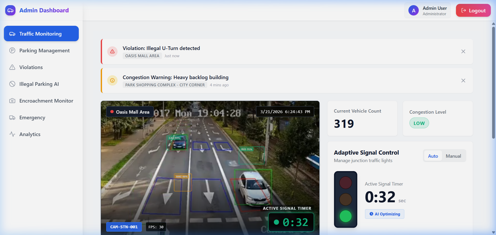
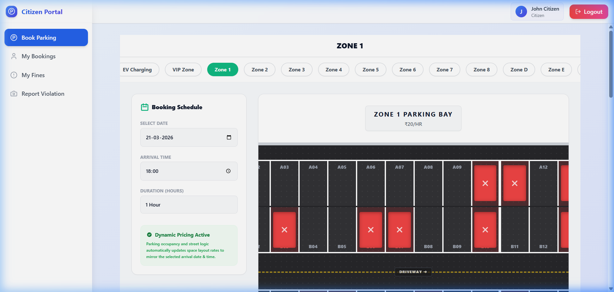
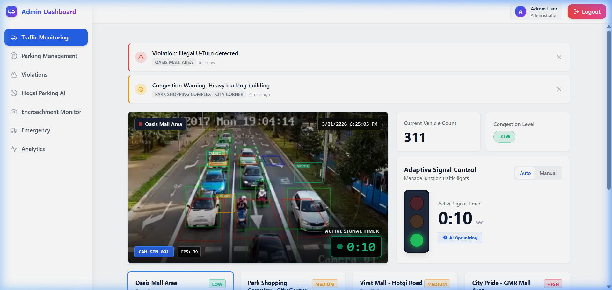
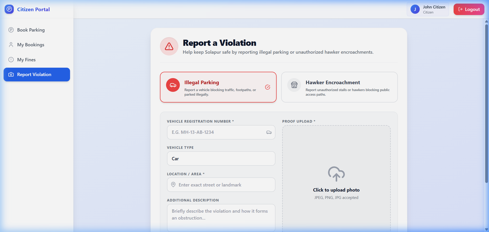

# 🚥 Smart City Traffic & Parking Management System


## 📌 Overview
The **Smart City Traffic & Parking Management System** is a massively comprehensive, real-time monitoring and municipal interaction dashboard. Engineered to bridge the gap between municipal authorities and local citizens, this platform offers live telemetry on traffic congestion, automated simulation of parking arrays with 100+ dynamic slots, and a secure reporting channel for civil violations like unauthorized hawkers and illegal parking events.

---

## 🔥 Key Features

### 🏢 1. Admin Authority Dashboard
A secure command center for municipal officials to oversee city logistics.
- **Dynamic Surveillance Monitor**: View 4 unique, dynamically switching real-life traffic feeds directly inside the UI. Selecting different Zones instantly maps distinct video streams natively.
- **Illegal Parking Tracking**: Live detection feeds natively catching cars parked outside boundary zones. Integrated directly with Citizen Reports.
- **Hawker & Encroachment Log**: Instant tracking of unauthorized vendors or blockages on public paths.
- **Fine Issuance Tool**: Automatically generate and dispatch digital fines directly to offender databases.

<p align="center">
  
</p>

### 🌆 2. Citizen Services Portal
A localized, easily accessible hub for citizens to engage with their municipality.
- **Interactive Theater-Scale Parking Map**: Browse completely dynamic, massive 168-slot mapping systems (A through L Lanes) rendering natively across numerous specific areas like *VIP Zone* and *Station Road*.
- **Real-time Availability Tracking**: Automatically caches parking reservations via local sockets. Booked spots instantly turn red and persist seamlessly.
- **SMC Reporting Module**: Fully built violation reporting form. Citizens can submit photo proof of illegally parked cars or blocking hawkers natively into the Admin's live WebSocket.

<p align="center">
  
</p>

---

## 🎥 Live Application Walkthroughs

### 1. Admin System Autonomy
<p align="center">
  <video src="docs/videos/admin_walkthrough.mp4" width="800" controls></video>
  <br/>
  <em>Automated authentication sequence parsing Live Security Camera Feeds natively alongside robust AI Parking Detection rendering algorithms.</em>
</p>

### 2. Citizen Interface Scale
<p align="center">
  <video src="docs/videos/citizen_walkthrough.mp4" width="800" controls></video>
  <br/>
  <em>Interactive evaluation of dynamically allocated 168-slot parking structures securely switching map zones to finalize comprehensive civic reporting submissions.</em>
</p>

---

## 📷 Platform Visuals (Screenshots)

### Live Video Traffic Control Room
<p align="center">
  
</p>
*Traffic control dashboard dynamically routing multiple distinct MP4 asset feeds based on the Zone actively selected by the admin.*

### Citizen Self-Reporting Tool
<p align="center">
  
</p>
*Robust citizen upload tool allowing picture attachment and real-time MongoDB hook integration for civil enforcement.*

---

## 🛠 Tech Stack

| Technology Layer | Stack Tools |
| :--- | :--- |
| **Frontend Framework** | React.js (Vite), React Router |
| **Styling & Icons** | Tailwind CSS, Lucide React Icons |
| **State Management** | React Hooks, LocalStorage Persist |
| **Backend API** | Node.js, Express.js |
| **Database** | MongoDB (Mongoose ORM) |
| **Realtime Events** | Socket.IO |

---

## 🚀 Getting Started

Follow these instructions to spawn the local development ecosystem:

### 1. Requirements Installed
* Node.js (v18+)
* MongoDB (Compass or Atlas)
* Git

### 2. Configure Backend Node Server
```bash
# Navigate to the backend directory
cd backend

# Install all NodeJS dependencies
npm install

# The server requires MongoDB initialized on port 27017 or matching the .env variables natively.
# Run the development listener:
npm run dev
```
> Ensure your database is running! The backend boots on **`http://localhost:5000`** safely logging `MongoDB connected!`.

### 3. Configure Frontend React Interface
```bash
# Open a completely separate new terminal tab and navigate to frontend
cd frontend

# Install UI packages
npm install

# Start the Vite HMR engine
npm run dev
```
> Open your browser to **`http://localhost:3000`**!

---

## 🔗 Architecture & WebSocket Integration
Every violation reported securely from the frontend `ReportViolation.jsx` form is structured natively and POSTed to backend Mongo `illegal-parking` & `encroachment` routes. Upon successful write, the backend executes `io.emit()` throwing the structured JSON instantly to any listening Admin Dashboard modules perfectly synchronously.

---

## 📂 Documentation

For more detailed information on specific features and setup, please refer to the following guides:

- **[System Architecture](docs/ARCHITECTURE.md)**: Detailed overview of the system design and data flow.
- **[Feature Guides](docs/guides/)**: Detailed instructions for Illegal Parking and Encroachment monitoring.
- **[Encroachment Flow](docs/guides/ENCROACHMENT_FLOW.md)**: Deep dive into the encroachment detection logic.
- **[Setup & Installation](docs/setup/)**: Step-by-step guides for environment configuration.
- **[Project History](docs/changes.md)**: Log of changes and updates during development.

---

## 🤝 Contributing

1. Fork the Project
2. Create your Feature Branch (`git checkout -b feature/AmazingFeature`)
3. Commit your Changes (`git commit -m 'Add some AmazingFeature'`)
4. Push to the Branch (`git push origin feature/AmazingFeature`)
5. Open a Pull Request

---

> Hand-crafted layout components built specially for robust municipal oversight!
